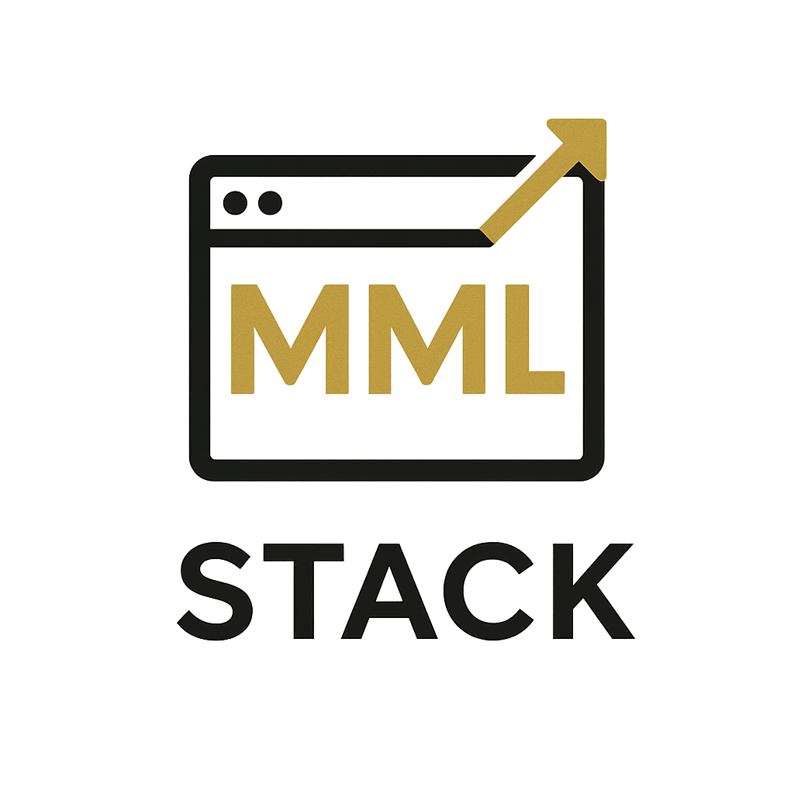

# 🌐 MML Website

Bienvenido al repositorio oficial de **MML Website**, un proyecto profesional de diseño y desarrollo web para empresas y emprendedores que buscan destacar en internet.  
Este sitio fue creado usando **React**, **Tailwind CSS**, **Framer Motion**, **Node.js**, **Express** y **MongoDB**.

---

## 🖼️ Vista previa

---

## ✨ Características principales

- 🎨 Diseño responsivo con Tailwind CSS
- 🎥 Hero con video de fondo a pantalla completa
- 🧭 Navegación con rutas dinámicas y submenús
- 📦 Backend con Express y MongoDB
- 📋 Formulario de contacto conectado a base de datos
- 📊 Contador animado y testimonios
- 🟢 Botón flotante de WhatsApp con respuestas automáticas
- 💬 Animaciones suaves con `framer-motion`

---

## 🚀 Demo local

### 🔧 Requisitos

- Node.js y npm
- MongoDB (local o Atlas)

🧠 Backend
bash

cd backend
npm install
npm run dev

🖥️ Frontend
bash

cd frontend
npm install
npm run dev

🧱 Estructura de carpetas
MML-WEBSITE/
│
├── backend/          → Servidor Express + rutas + modelos
├── frontend/         → Cliente React con Tailwind, componentes, páginas
├── .gitignore
└── README.md

🛡️ Tecnologías
-React
-Tailwind CSS
-Framer Motion
-Vite
-Node.js
-Express.js
-MongoDB + Mongoose
-Axios

🧠 Autor
Marian Molina López
Desarrolladora Full Stack 💻

⭐ Licencia
MIT License — ¡Usa este proyecto para aprender, mejorar o crear el tuyo propio!

Hecho con 💜 por Marian Molina.
